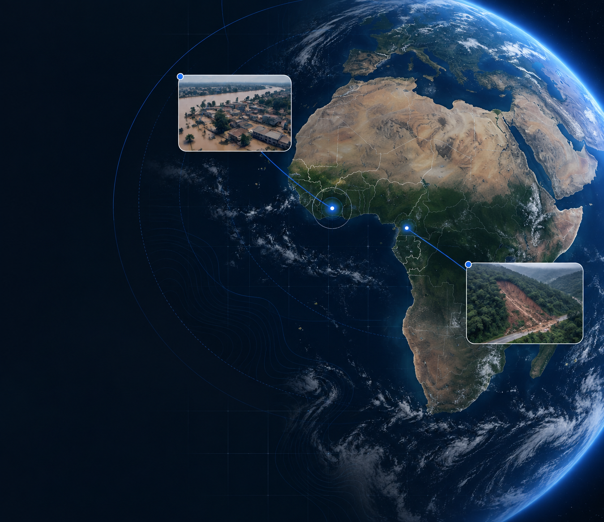

# Avert

**Disaster intelligence for earlier action.** A flood monitoring and response workspace for Ghana and Cameroon, built for the Pan-African AI Summit Hack-AI-Thon (Accra, 22–23 September 2026).



Avert turns scattered flood evidence — satellite-derived terrain, OpenStreetMap infrastructure, historical events, live rainfall and news reporting — into one operational picture: what happened, what's likely to happen next, and who to reach first.

## Why

Flood response in West and Central Africa is data-rich but evidence-scattered: terrain models, news photos, dam-release advisories and community reports live in different places and rarely get cross-referenced before a decision gets made. Avert's core bet is that a *disciplined evidence model* — every number tagged with where it came from and how confident we are in it — is worth more than a flashier dashboard that blurs the line between observed, modeled and reported.

## What's in the app

| Screen | What it does |
| --- | --- |
| **Monitor** | Interactive map with historical flood reconstruction (day-by-day playback) and a forward-looking risk forecast, per community |
| **Communities** | Sortable, filterable table of every mapped settlement — exposure, road access, response priority — synced to the map |
| **Evidence** | Photographs, map layers and source reports behind each assessment, plus a live "Recent reports" feed of fresh incidents |
| **Ask Avert** | An AI assistant grounded only in the data on screen — cites its sources, explains scores, never invents numbers |
| **Alerts** | A three-step community-warning composer with a deterministic SMS delivery simulation (audience → message → review → results) |
| **Account / Preferences** | Demo identity, saved regions, map appearance, units, language, motion and notification preferences |
| **Compact preview** | A QR-linked, phone-sized version of the assessment view for field use |

### Coverage today

- **4 basins**, Ghana and Cameroon: Lower Volta, White Volta, Far North/Logone, Douala
- **1,000+ mapped settlements** with real terrain features (elevation, HAND, distance-to-river) from SRTM 30 m via OpenTopoData
- **28 tracked data sources** across live feeds, curated records and modeled outputs — every one labeled honestly as `real`, `curated`, `modeled` or `planned`
- **16 freshly researched incident/report records** merged from September 2026 field reporting, each with real photo evidence and source links

## Evidence, not vibes

Every figure in Avert carries a provenance tag — `OBSERVED`, `FORECAST`, `INFERRED`, `ASSESSED`, `REPORTED` or `UNVERIFIED` — so an operator (or a judge) can always see whether a number came from a sensor, a model, or a news article. Response-priority and next-flood-risk scores are interpretable weighted indices with named, auditable factors — not a black-box model dressed up as one. The intelligence pipeline panel in Monitor walks through exactly how a score is built, end to end.

## Ask Avert

A contextual assistant scoped to exactly what's on screen: it receives a structured snapshot of the current region, event and selected community (never a full dataset dump), and is instructed to cite only sources it was actually given, flag missing inputs instead of guessing, and never invent evacuation orders, shelters or emergency numbers. It runs through a small server-side adapter compatible with OpenAI and Azure OpenAI — the API key never touches the browser. Without a key configured, Ask Avert shows an honest "unavailable" state instead of pretending to work.

## Alerts are simulated, not sent

The alert composer produces a fictional-recipient SMS delivery simulation — deterministic, seeded, with reconcilable delivery/failure counts and retry accounting. No real message is ever sent; every simulated message carries an unmistakable `AVERT DEMO` marker.

## Tech stack

React 18 · TypeScript · Vite · MapLibre GL JS · Zustand · Turf.js · Tailwind CSS v4 · Motion

No backend database — regional/community data ships as static GeoJSON, app state lives in the browser, and the one server-side piece (Ask Avert) is a small framework-agnostic handler that runs identically under Vite's dev server and as a Vercel serverless function.

## Getting started

```bash
npm install
npm run dev
```

Open `http://localhost:5173`. Sign in with the demo workspace option on the login screen — no account required.

### Optional: enable Ask Avert

Copy `.env.example` to `.env.local` and set:

```
OPENAI_API_KEY=your-key
OPENAI_BASE_URL=          # leave blank for api.openai.com, or set an Azure OpenAI v1 endpoint
OPENAI_MODEL=gpt-4o-mini  # or your Azure deployment name
```

### Other scripts

```bash
npm run build      # typecheck + production build
npm run test        # vitest — simulation engine + SMS segmentation invariants
npm run preview     # serve the production build locally
```

## Deployment

Deploys to Vercel with zero configuration — Vite is auto-detected and `api/ask-avert.ts` is picked up automatically as a serverless function. Add the three `OPENAI_*` variables above under Project Settings → Environment Variables to enable Ask Avert in production; everything else works without them.

## Project structure

```
src/
  components/   shell, map, inspector, chat, alerts UI
  pages/        routed screens (Monitor lives in App.tsx; the rest are here)
  data/         static geo/event/source registries
  services/     exposure, forecast, weather and AI-context logic
  domain/       pure alert-simulation and SMS-segmentation logic (tested)
  stores/       alerts and preferences state (Zustand)
server/         shared Ask Avert handler (dev middleware + Vercel function both use this)
api/            Vercel serverless entrypoint
docs/           design system and screen specifications for this refactor
record/         provenance for the September 2026 evidence pack merged into the app
```

## Honesty notes

- Modeled flood extents are river-channel buffer approximations, not satellite-derived polygons — labeled as such throughout.
- Response-priority and forecast-risk scores are ordinal indices, not calibrated probabilities.
- Recent news photos are linked to their original publisher, not rehosted as verified evidence.
- Nothing here claims live telecom integration, a trained prediction model, or operational landslide coverage — those are explicitly marked "coming soon" where the product roadmap includes them.

---

Built by Audran-wol for the Pan-African AI Summit Hack-AI-Thon, September 2026.
